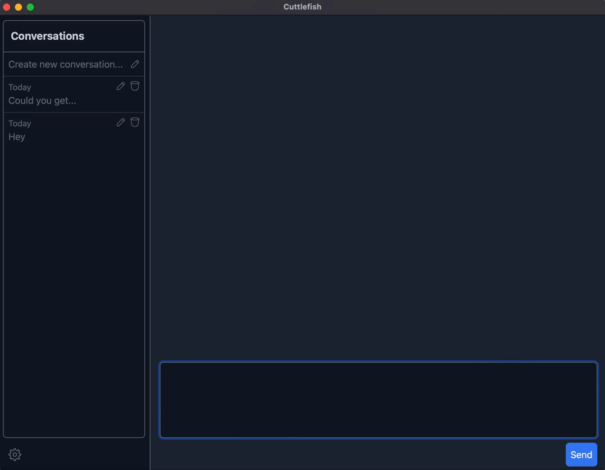

# Cuttlefish

Cuttlefish is a desktop chat app for ChatGPT. It's main feature is the ability to use tools, like the terminal, search, or get information from URLs. Specifically, it can use **your local terminal** to accomplish tasks you give it.

It supports the ChatGPT-3.5 model, as well as GPT-4. It uses an OpenAI platform API key and is mainly aimed at a technical users.

---

Let's start with two quick demos, that show the power of Cuttlefish. First, a simple example of using the Terminal tool:


And now, a more complex example that uses a combination of the search, get_url, and chart tools:


## Installation
On MacOS you can just
```
brew tap cube2222/cube2222
brew install cuttlefish
```

on other systems, download the archive for your system from the latest release and run the binary inside it.

## Tools
There's multiple tools available in Cuttlefish. Let's go over them one by one.

### Terminal
The most powerful tool, really. It allows the Assistant to run arbitrary commands on your host. It's very useful to give it tasks to do and have it solve them. It's also quite useful to ask questions about your own computer.

By default, terminal commands require approval, so you'll be able to review them before they actually get executed. However, you can customize that in the settings.

### Search
Search allows the Assistant to search the web using Google Custom Search. You'll need to set up the proper API keys (the app settings contain a how-to), but on the plus side, as of the time of writing, the first 100 searches per day are free.

If you wonder why just scraping Google web results is not the right approach - it's because that will quickly get your IP banned.

### URL Getter
The URL Getter allows the Assistant to get the contents of a specified website. It's very useful when paired with the search tool in order to drill down on the results. In order to limit the size of the data, it has a couple of optimizations:

- It has custom parses for certain websites, as of the time of writing that's Wikipedia and StackOverflow.
- For other pages, it will only get the first 300 words of the (heuristically found) main content of the page.

### Chart
Displays a chart using Apache ECharts. The assistant should use it whenever you ask it to plot/chart something.

### Image Generator
Uses Dalle2 to generate an image and embed it in the chat.

### Python
Even though the Assistant can use the Terminal to run short Python scripts, an explicit Python tool is included as well.
However, it's disabled by default, because the Assistant tends to overuse it, and it's not as consistently successful as with other tools.

## Configuration
You can configure global app settings or conversation settings. With the conversation settings being either specific to a single conversation or the default that's used for new ones.

Additionally, conversation templates are on the roadmap and will let you have multiple "personalities" (sets of default conversation settings) to chat with.

### Models
Cuttlefish support both GPT-3.5-Turbo and GPT-4. GPT-3.5 often goes off the rails and requires you to retry your prompts, but it tends to get there eventually. GPT-4 is much more stable and consistent, but is waaaaay more expensive, so take care when using it - it's also quite slow.

## Roadmap
- Conversation Templates - have more than just a single set of default conversation settings for newly created chats
- Custom rendering for tool inputs and outputs
- SQL tool to let the Assistant interact with a database
- DuckDB tool with functionality similar to https://github.com/cube2222/DuckGPT
- Embedded conversational code editor
- Inception-like nested conversations (the Assistant as a tool for the Assistant)
